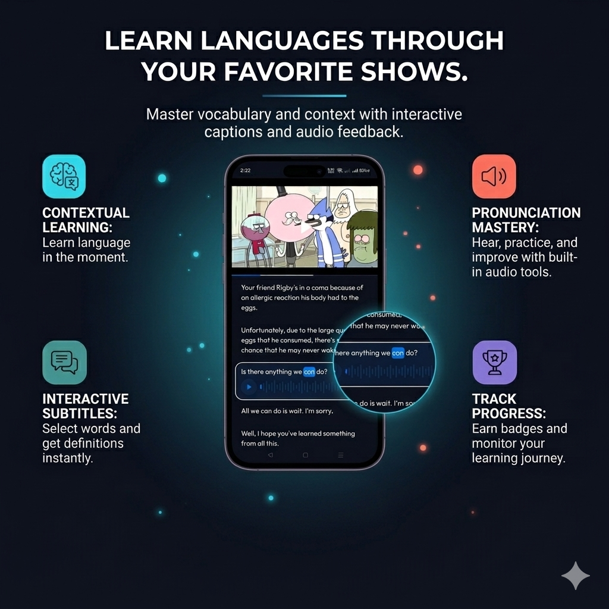
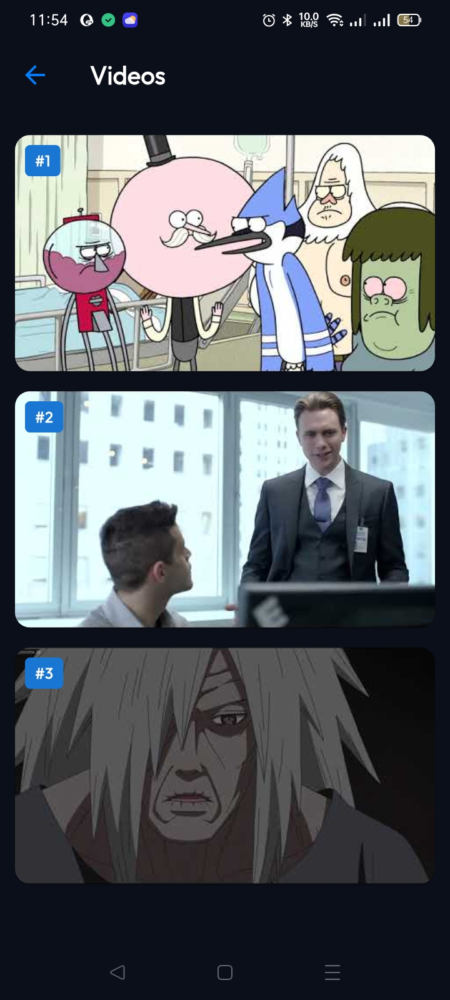
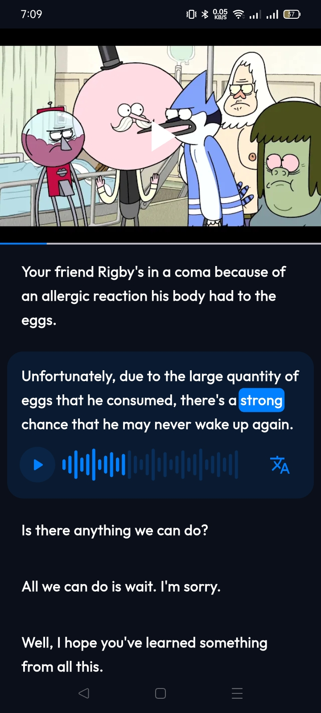
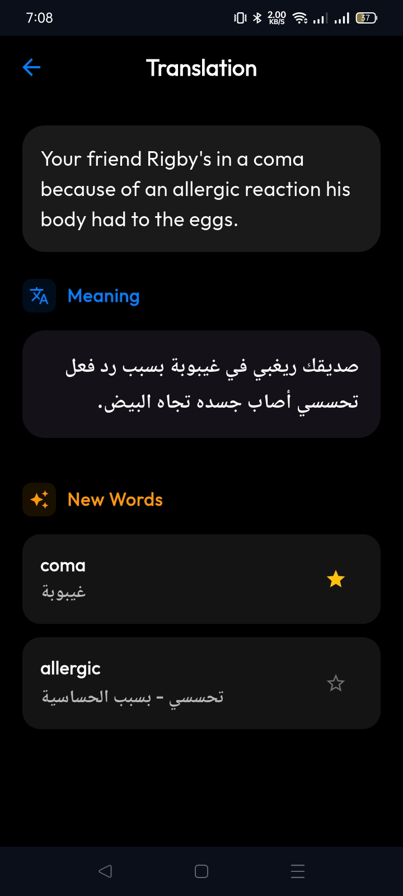
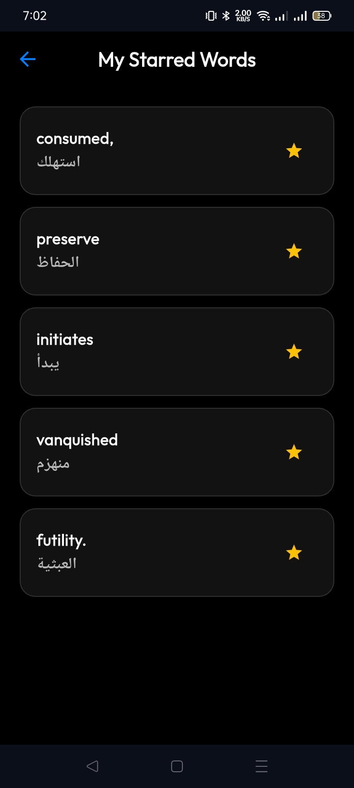
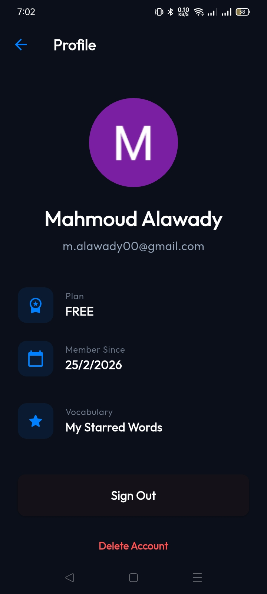

# Video Over App 🚀

> Master English through immersion with interactive YouTube video transcripts.



<div align="center">

### [🌐 Landing Page](https://video-over.pages.dev) 
</div>

---

## 📺 Project Overview
**Video Over** is a specialized language learning application designed to help users improve their English proficiency through contextual learning. By integrating YouTube speaking videos with synchronized, interactive transcripts, it provides an immersive environment for language acquisition.

## 📸 App Screenshots
<div align="center">
  
  
  
  
  
</div>

## ✨ Key Features
- **Interactive Transcripts**: Real-time synchronization between video playback and transcript text for focused learning.
- **YouTube Integration**: Seamless streaming of curated educational content directly from YouTube.
- **Precision Audio Control**: Granular playback management, enabling looping of specific segments for repetitive practice.
- **Secure Authentication**: Robust user sign-in and profile management powered by **Google Sign-In**.
- **Offline Reliability**: Local data persistence using **Flutter Secure Storage** for session management and user preferences.
- **Premium UI/UX**: A sleek, responsive interface built with the **Outfit** font family and modern Flutter design patterns.

## 📦 Direct Download
Get the latest stable release for Android:

[📲 Download APK (ARM64)](assets/release/app-arm64-v8a-release.apk)

## 🛠️ Tech Stack
This project showcases modern Flutter development best practices and a robust technical foundation:

- **Framework**: [Flutter](https://flutter.dev) (Dart)
- **State Management**: [BLoC/Cubit](https://pub.dev/packages/flutter_bloc) for predictable state transitions and clean separation of concerns.
- **Dependency Injection**: [GetIt](https://pub.dev/packages/get_it) for a decoupled, testable service locator architecture.
- **Networking**: [Dio](https://pub.dev/packages/dio) for efficient API communication with interceptor support.
- **Multimedia**: [just_audio](https://pub.dev/packages/just_audio) & [youtube_player_flutter](https://pub.dev/packages/youtube_player_flutter).
- **Reactive Programming**: [RxDart](https://pub.dev/packages/rxdart).
- **Architecture**: **Clean Architecture** (Feature-driven modular structure) ensuring scalability and maintainability.

## 🏗️ Project Structure
```text
lib/
├── core/          # Reusable components, shared services, and cross-cutting helpers
│   ├── di.dart    # Centralized Dependency Injection setup
│   ├── services/  # Shared system-wide services
│   └── helpers/   # Utility functions and extensions
├── features/      # Modular implementation of core app functionalities
│   ├── auth/      # Authentication logic, Cubits, and UI
│   ├── videos/    # Video listing, discovery, and management
│   ├── player_page/ # The heart of the app: Interactive Player + Transcripts
│   └── profile/   # User settings and personalized data
└── main.dart      # Standard application entry point
```

## 🚀 Getting Started
To get a local copy up and running, follow these simple steps:

1. **Clone the repository**:
   ```bash
   git clone https://github.com/Mahmoud-Alawady/video_over_app.git
   ```
2. **Install dependencies**:
   ```bash
   flutter pub get
   ```
3. **Run the application**:
   ```bash
   flutter run
   ```

## 🤝 Contact
If you're a recruiter or fellow developer, feel free to reach out and explore my work!

---
*Developed by Mahmoud Alawady — Aiming for excellence in Flutter development.*
